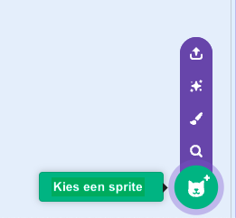
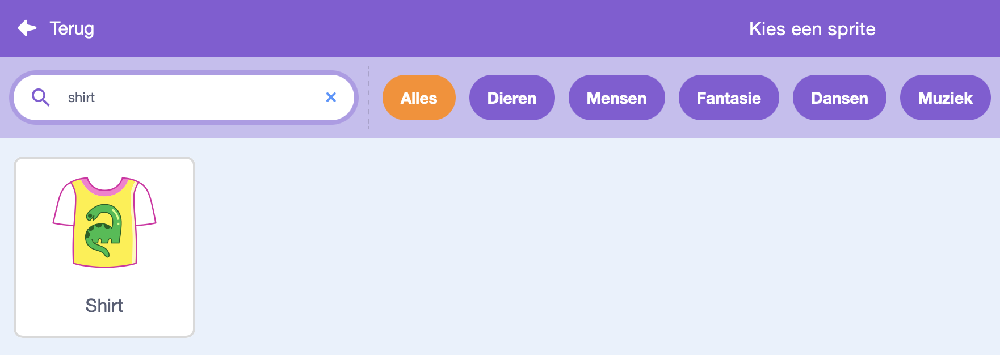
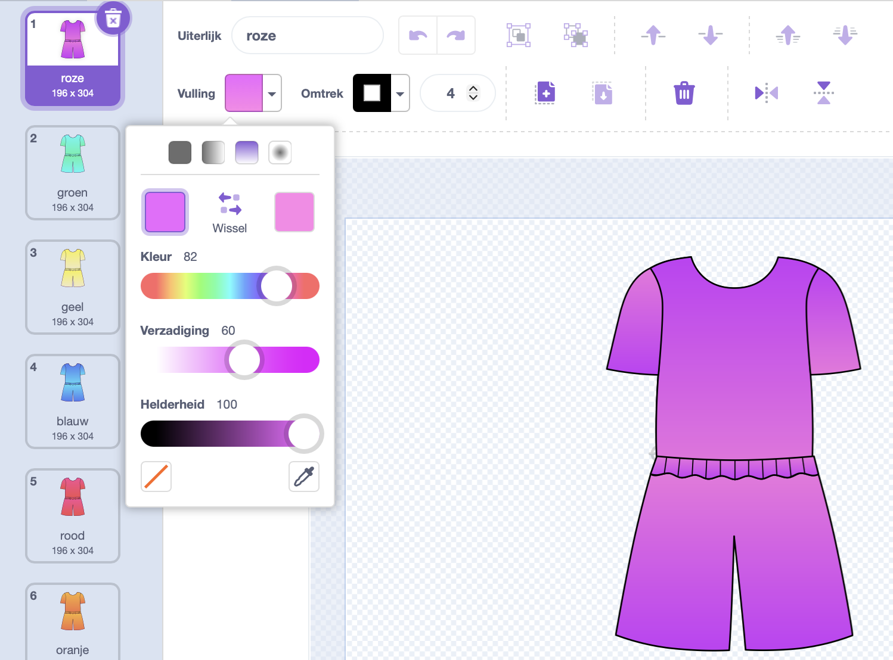
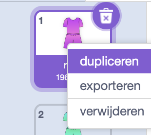
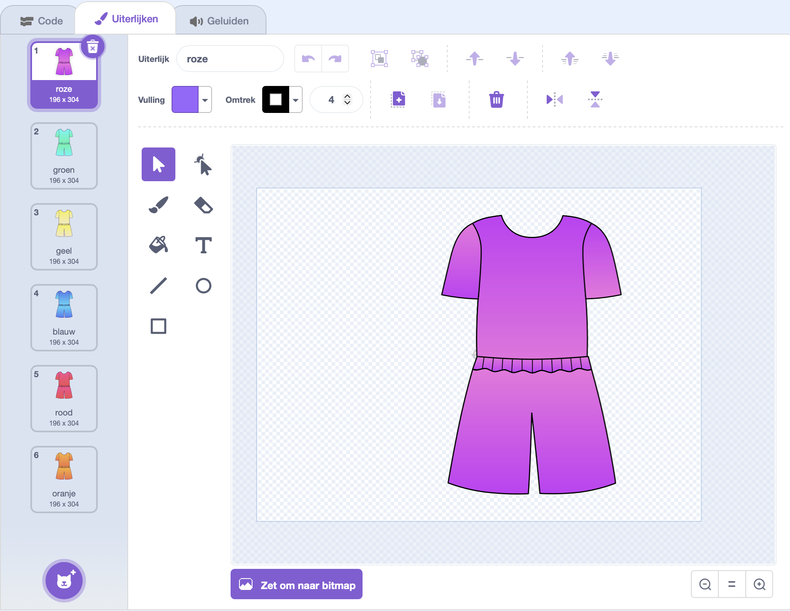

## Maak je eigen tenue

In deze stap ontwerp je de basis van het tenue en kun je ook een achtergrond toevoegen.

\--- task ---

Verwijder de kattensprite en maak een sporttenue aan. Je kunt een sprite kiezen of er zelf een tekenen met het tekengereedschap.

Je kunt zoeken op "shirt".

{:width="400px"}

\--- /task ---

\--- task ---

Pas het ontwerp naar wens aan en voeg je eerste kleur toe met het vulgereedschap. Gebruik de verloopvulling om een kleurrijk uiterlijk te maken.

{:width="500px"}

\--- /task ---

\--- task ---

Klik met de rechtermuisknop op de sprite om het uiterlijk te dupliceren voor elke kleur die je wilt gebruiken.

\--- /task ---

\--- task ---

Geef elk shirt-uiterlijk een nieuwe kleur en geef ze een bijpassende naam.

{:width="450px"}

\--- /task ---
