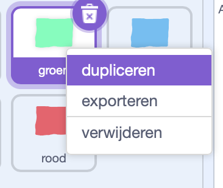
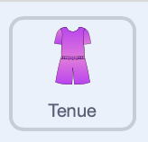

## Maak kleurenkiezers

\--- task ---

Maak de sprites om kleuren te kunnen kiezen. Dit kunnen vierkanten en cirkels zijn, of je kunt ze zelf tekenen met het tekengereedschap.

Klik met de rechtermuisknop om een sprite te dupliceren en de vulling voor elke kleur te wijzigen. Geef ze vervolgens een naam die overeenkomt met de kleur.

{:width="500px"}

\--- /task ---

\--- task ---

Voeg in het codeblok `wanneer op deze sprite wordt geklikt`{:class="block3events"} een `zend signaal`{:class="block3events"} bericht toe aan elke kleursprite.

Geef het nieuwe bericht dezelfde naam als de kleur.

```blocks3
+when this sprite clicked
+broadcast [blue v]
```

\--- /task ---

\--- task ---

Selecteer de tenue-sprite.

{:width="300px"}

\--- /task ---

\--- task ---

Voeg een `wanneer ik signaal ontvang`{:class="block3events"} blok toe dat het uiterlijk van het tenue voor elke kleur `verandert naar`{:class="block3looks"}

```blocks3
+when I receive [blue v]
+switch costume to [blue v]
```

\--- /task ---

Test je project!

Klik op een kleur om te zien of je tenue verandert 👕


