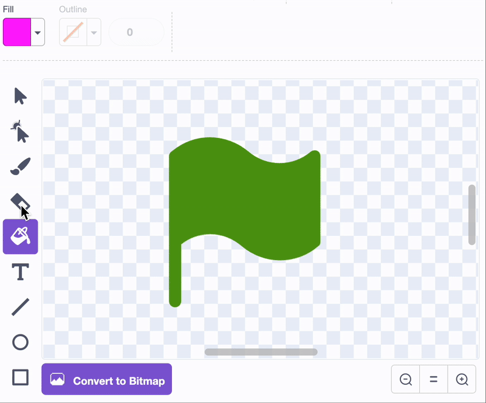
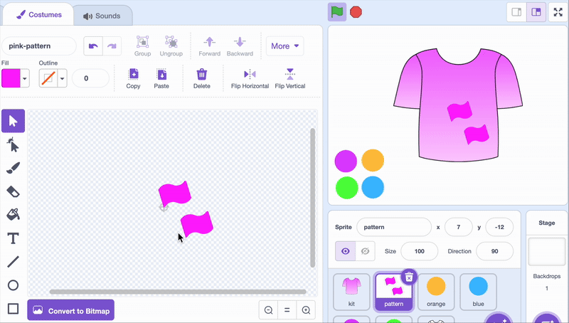
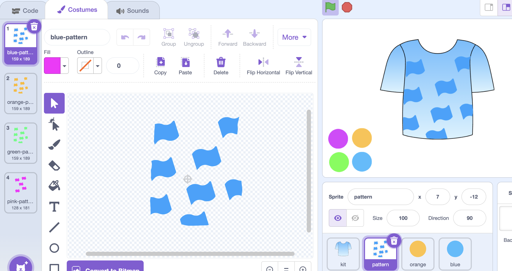

## Teken een patroon

Maak een patroon sprite om je tenue mee te versieren.

\--- task ---

Maak een nieuwe sprite en noem deze 'patroon'.

\--- /task ---

\--- task ---

Teken een vorm voor je patroon.

{:width="500px"}

\--- /task ---

\--- task ---

Om het patroon te maken, kopieer en plak je de vorm of teken je een nieuwe vorm en verplaats je deze naar de gewenste positie. Ga hiermee door totdat je een patroon hebt dat je mooi vindt.

{:width="500px"}

\--- /task ---

\--- task ---

Klik met de rechtermuisknop om je uiterlijk patroon te dupliceren en vul elke kleur in. Je kunt de kleuren eventueel iets anders maken dan in het tenue, zodat ze nog meer opvallen.

{:width="500px"}

\--- /task ---

