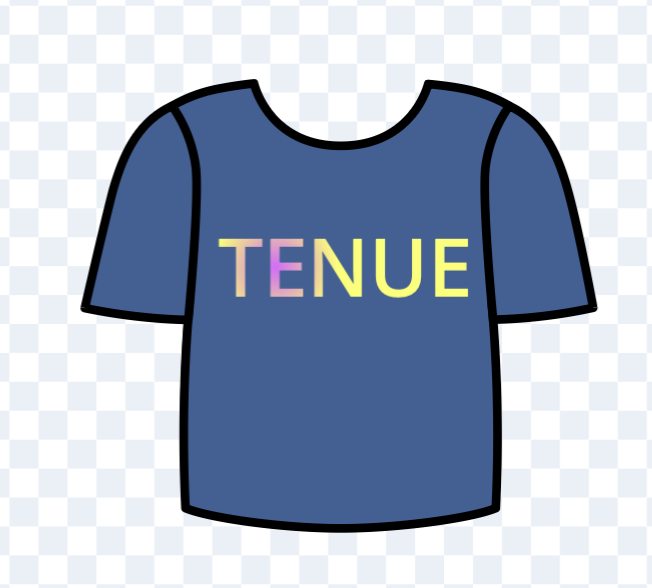
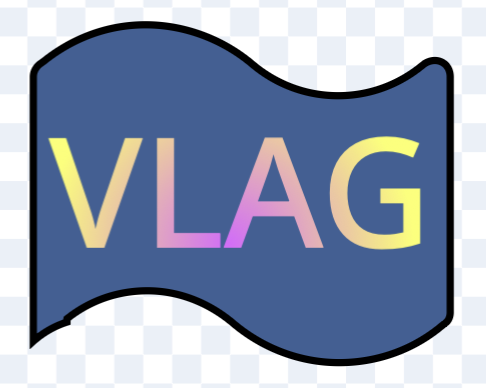
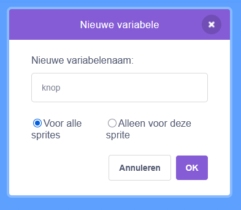

## Voeg een knop toe

Maak een knop-sprite om te schakelen tussen het inkleuren van het tenue en het patroon.

\--- task ---

Maak een nieuwe sprite.

Teken knop 1 en voeg tekst toe voor het tenue. Je kunt een t-shirtvorm of een gewone knopvorm gebruiken.



\--- /task ---

\--- task ---

Maak een nieuw uiterlijk en teken knop 2. Voeg tekst toe voor het patroon.

Zorg ervoor dat je verschillende knoppen maakt.

{:width="500px"}

\--- /task ---

\--- task ---

Om tussen de knoppen te schakelen, maak je een nieuwe `variabele`{:class="block3variables"} aan en geef je deze de naam 'knop'.

{:width="450px"}

\--- /task ---

\--- task ---

Gebruik het groene `vlag`{:class="block3events"} blok en `maak knop patroon`{:class="block3variables"}

```blocks3
+ when flag clicked
+ set [button v] to [pattern]
```

\--- /task ---

De knop verandert wanneer we erop klikken.

\--- task ---

Gebruik het `wanneer op deze sprite wordt geklikt`{:class="block3events"} blok.

Voeg een als dan`{:class="block3control"} blok toe; zo kun je wijzigen wat in variabele `knop`{:class="block3variables"} wordt opgeslagen. Voeg hier een `functies\`{:class="block3operators"}-blok toe.

`Als`{:class="block3control"} de knop is ingesteld op tenue, veranderen we hem naar patroon. Anders (`dan`{:class="block3control"}) behouden we de instelling als tenue.

```blocks3
+ when this sprite clicked
+ if <(button) = [kit]> then
set [button v] to [pattern]
else
set [button v] to [kit]
```

\--- /task ---

\--- task ---

Wissel tussen uiterlijken met de knop `variabele`{:class="block3variables"}.

Als de knop op patroon staat, verander dan het uiterlijk naar patroon, anders verander je het uiterlijk naar tenue.

Plaats dit binnen het `herhaal`{:class="block3control"} blok, anders zal het maar één keer wisselen.

```blocks3
when flag clicked
set (button) to [pattern]
+ forever
if <(button) = [kit]> then
switch costume to [pattern-button v] 
else 
switch costume to [kit-button v]
```

\--- /task ---

Test of het gelukt is door op de groene vlag te klikken. Als je nu op de knop in het speelveld klikt, zou er tussen de twee uiterlijken moeten worden geschakeld 🔘
