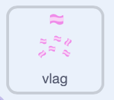

## Kies alle kleuren!

In deze stap kun je de kleuren van het tenue of het patroon aanpassen voor een volledig gepersonaliseerd tenue!

\--- task ---

Voeg in de tenue-sprite een `als`{:class="block3control"} blok toe aan het blok dat je eerder hebt gemaakt. Dit wisselt alleen van uiterlijk als de knop is ingesteld als 'tenue'.

{:width="300px"}

```blocks3
when I receive [blue v]
+ if <(button) = [kit]> then
 switch costume to [blue v]
```

Doe dit voor elk van de kleuren en test of het werkt.

\--- /task ---

\--- task ---

Voeg in de patroon-sprite voor elke kleur het `ontvang`{:class="block3events"} blok toe.

{:width="300px"}

Voeg hier een `als`{:class="block3control"} blok aan toe en `verander uiterlijk naar`{:class="block3looks"} als de knop is ingesteld als patroon. Dit lijkt erg op de blokken die je voor het tenue hebt gemaakt.

TIP! Om tijd te besparen, kun je de blokken kopiëren en plakken en vervolgens alleen de kleurnamen wijzigen.

```blocks3
+ when I receive [pink v]
+ if <(button) = [pattern]> then
 switch costume to [pink v]
```

\--- /task ---

Probeer het eens uit! Je hebt een tenue-kiezer gemaakt. Je kunt de kleuren van het tenue en het patroon aanpassen om een eigen ontwerp te maken!

